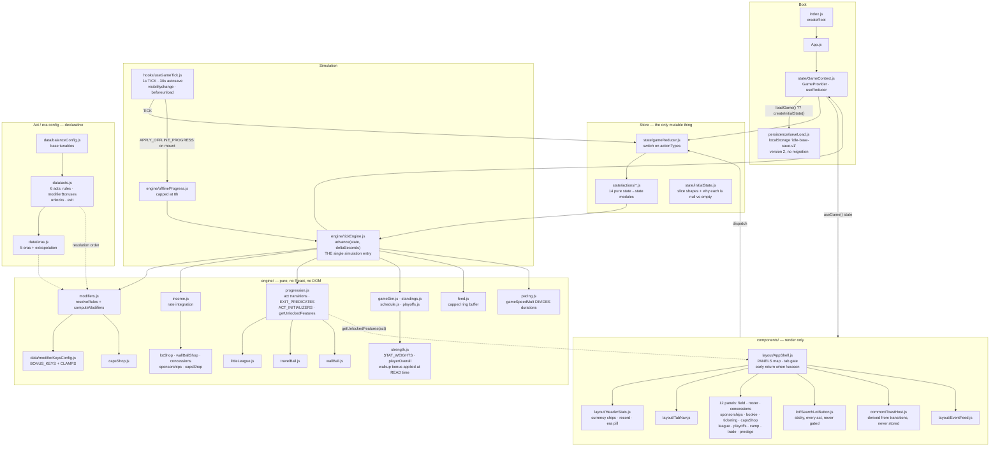

# Architecture — idle-base

<!-- generated by /kb-generate — last_crawl_commit: ece8760a02e784dba77a283ca07e2c1a39273b81 -->

## Overview

A baseball-themed idle/incremental game that runs entirely in the browser. No server, no
backend, no network calls: React renders, a `useReducer` store holds the whole game, a 1-second
timer advances a pure simulation, and `localStorage` persists it. Everything ships as a single
webpack bundle to GitHub Pages.

The codebase enforces one structural rule above all others: **`src/engine/` is pure and knows
nothing about React**, `src/data/` is config with no logic, and `src/components/` renders what
the engine decides without deciding anything itself. Every shop follows the same contract — an
engine exposes `listOffers(state)` returning presentation-ready rows with cost/ownership/
affordability already resolved, and a `purchase(state, id)` that returns new state or `null`
for "refused". A component that recomputes affordability is doing it wrong.

The game is structured as a six-act **odyssey** (`src/data/acts.js`) played once per save, with
**prestige eras** (`src/data/eras.js`) replaying the final act. Acts and eras are the same
shape — a declarative `rules` override plus additive `modifierBonuses` — deliberately, so there
is one config system rather than two.

## Diagram

## Key Components

### `src/state/` — the store
`GameContext.js` is a `useReducer` over the entire game state, hydrated once from
`localStorage`. `gameReducer.js` is a flat `switch` that delegates to one of fourteen pure
modules under `state/actions/`. No thunks, no middleware, no async. Every action module is
`(state, action) => state` and returns the *identical object reference* when a request is
refused, which several call sites rely on to detect "nothing happened".

`initialState.js` is worth reading before touching state: its comments encode the rule for
which slices are `null` (player-visible CONTENT that its act creates — `stadium`, `league`,
`season`) versus present-and-empty (tick-loop COLLECTIONS that `advance()` dereferences every
iteration — `roster`, `powerups`, every shop's purchase list).

### `src/engine/` — the simulation
Thirty-odd pure modules. `tickEngine.js:advance(state, deltaSeconds)` is the single place
simulation happens, called identically by the live 1-second timer and by the load-time offline
catch-up — only `deltaSeconds` differs. It integrates income as *rates* over each step rather
than firing per-second events, so an 8-hour return resolves in a handful of iterations rather
than 28,800.

`modifiers.js` carries the two-axis system that acts and eras both feed:
- **`resolveRules(state)`** — `balanceConfig <- act.rules <- era.rules`, layered by spread so a
  legitimate `0` (e.g. `playoffTeams: 0`, a league with no postseason) is distinguishable from
  "not overridden".
- **`computeModifiers(state)`** — additive percentage bonuses composed
  `act <- era <- capsShop <- perks <- powerups`, each clamped, returned as ready-to-multiply
  factors. Also carries `.rules` so consumers get both from one call.

`progression.js` owns act transitions. `getUnlockedFeatures(actIndex)` is **derived on every
read and never stored**, which makes retuning which act unlocks a feature take effect on an
existing save with no migration. `EXIT_PREDICATES` holds the machine-checkable condition that
ends each act; `ACT_INITIALIZERS` creates the content each act owns (entering Act III is what
first builds a season).

### `src/data/` — config, no logic
Every tunable number and every string of player-facing prose. The comments here are unusually
long and carry measured simulation results justifying each value — they are the design record,
not decoration. `acts.js` is the highest-value file in the repo for orientation.

### `src/components/` — presentation
`AppShell.js` is the router: a `PANELS` map whose keys are feature ids from an act's `unlocks`
array, filtered through `getUnlockedFeatures`. Locked tabs are not rendered at all. It early-
returns a pre-season shell when `state.season` is absent (Acts I–II), which is why every hook
must sit above that return.

## Data Flow

**Live tick.** `useGameTick` fires `TICK` every 1000ms → `seasonActions.tick` → `advance(state, elapsed)`.
Inside each iteration `advance` computes modifiers, finds the next scheduled event
(`findNextEventClock`), steps the clock to whichever comes first, integrates income across that
step, then runs expiry/camp/season-phase/act-transition checks. Feed entries append through the
capped ring buffer. React re-renders from the new state object.

**Player action.** Component dispatches → reducer → action module → engine `purchase()`/
`resolve()` → new state or `null`. The engine re-clamps whatever the UI sent, unconditionally;
the UI is convenience and never the guarantee.

**Offline return.** On mount `useGameTick` dispatches `APPLY_OFFLINE_PROGRESS`. `offlineProgress.js`
caps elapsed wall-clock at `balanceConfig.offlineCapSeconds` (8h) and calls the same `advance()`.
This is why anything that fires per-event must be idempotent and storm-resistant: a whole season
can resolve inside one `advance()` call. Toasts are derived from state transitions specifically
to avoid this (`ToastHost.js`), and sponsor announcements keep a ledger rather than diffing.

**Persistence.** Autosave every 30s, plus `visibilitychange` and `beforeunload`. `loadGame()`
discards any save whose `meta.version` differs — **there is no migration path by design**. In
practice this means new state slices must be readable when absent, via a defaulting accessor
(the `wallBallSlice()` / `concessionsSlice()` pattern), so an in-flight save keeps working.

## External Dependencies

Deliberately almost none.

- **Runtime:** `react` ^18.3.1, `react-dom` ^18.3.1. That is the entire dependency list.
- **Build:** webpack 5 + `babel-loader` (`@babel/preset-env`, `@babel/preset-react`),
  `style-loader`/`css-loader`, `html-webpack-plugin`. `npm start` serves on 8080; `npm run build`
  emits `dist/`.
- **No test runner.** `package.json` has only `start` and `build`. The only automated gate is
  the webpack build; engines are plain CommonJS and are conventionally verified by driving them
  under `node` directly.
- **No database, no API, no auth.** Persistence is `localStorage` under `idle-base-save-v1`.
- **Deploy:** GitHub Pages via `.github/`.
